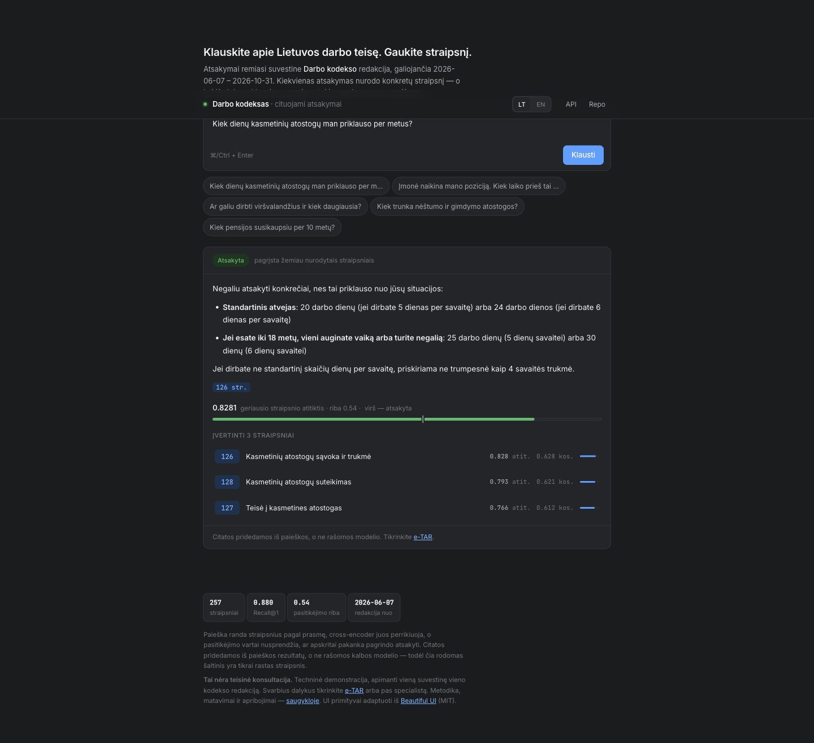
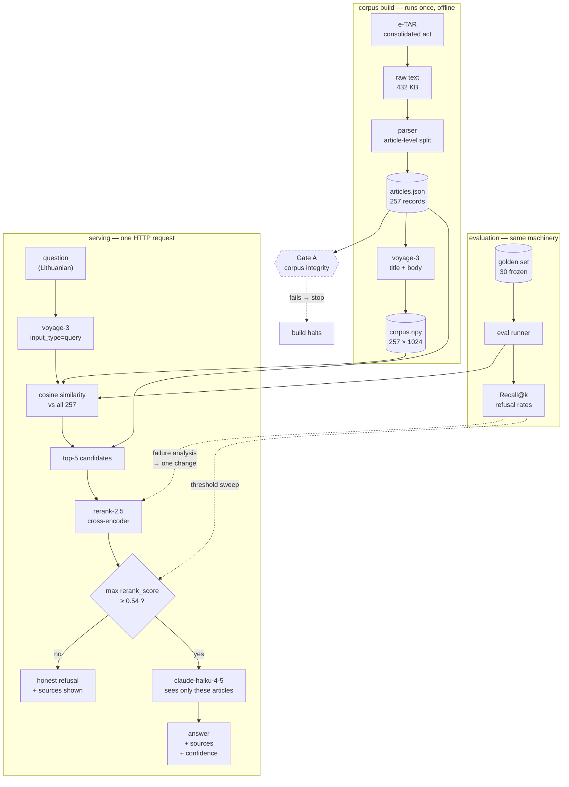

# Lithuanian Labour Code RAG

[](https://github.com/dziugasmarcenas-ui/legal-rag/actions/workflows/ci.yml)

**A deployed retrieval-augmented assistant that answers Lithuanian employment-law
questions from 257 primary-source Labour Code articles, cites the governing article,
and refuses when the available text is not sufficient.**

[Try the live application](https://legal-rag-production-fac6.up.railway.app) ·
[Read the case study](docs/portfolio/CASE_STUDY.md) ·
[Use the demo guide](docs/portfolio/DEMO.md) ·
[Reuse the application copy](docs/portfolio/APPLICATION_BULLETS.md)



> **Status: V1 shipped.** Public FastAPI application, bilingual interface,
> versioned corpus, frozen evaluation set, CI checks, Docker image, and measured
> retrieval improvement. This is an information-retrieval demonstration, not
> legal advice.

## Results at a glance

| Evidence | V1 result |
|---|---|
| Source coverage | 257 articles from one pinned consolidated edition |
| Recall@1 | 0.720 → **0.880** after reranking |
| Recall@3 | 0.840 → **0.920** after reranking |
| Recall@5 control | 0.920 → 0.920, as expected for reordering only |
| Abstention | Confidence gate returns an explicit refusal below 0.54 |
| Delivery | FastAPI, Docker, Railway, GitHub Actions, LT/EN interface |

## What I built

I scoped the product, replaced a misleading five-document prototype with the
versioned primary-source corpus, implemented retrieval and evaluation, froze and
verified the benchmark before tuning, diagnosed ranking failures, introduced a
cross-encoder reranker, added confidence-based abstention, built the API and
interface, and deployed the container publicly.

The useful result is not only the metric increase. The evaluation separates
candidate-generation, ranking, answerability, and generation failures, so the
remaining limitations are visible rather than hidden behind a polished demo.

## Stack

Python 3.12 · FastAPI · Voyage embeddings and reranking · Anthropic Claude ·
NumPy · pytest · Docker · Railway · GitHub Actions

## Portfolio material

- [Case study](docs/portfolio/CASE_STUDY.md) — decisions, ownership, evidence, and lessons
- [Demo and interview guide](docs/portfolio/DEMO.md) — 90-second and four-minute walkthroughs
- [Application bullets](docs/portfolio/APPLICATION_BULLETS.md) — CV, LinkedIn, and role-specific copy

---

## V1 scope and delivery record

The original scope was frozen on 2026-08-20 before the measured build began.

### Original requirements — completed

- [x] Corpus: consolidated Darbo kodeksas (XII-2603), parsed to article-level records
      carrying `article`, `title`, `text`, `source`, `act_number`, `edition_from`, `edition_to`
- [x] Article-level chunking, embeddings persisted to disk (re-runs do not re-embed)
- [x] Top-k dense retrieval, inspectable with zero LLM calls
- [x] Confidence gate that abstains rather than guessing
- [x] `POST /chat` and `GET /health` over HTTP, publicly deployed
- [x] A golden set of 30 questions (~5 unanswerable), each expected article
      manually verified, **frozen before any tuning**
- [x] Two separate benchmarks: retrieval quality and abstention behaviour
- [x] One measured baseline, one diagnosed failure, one justified fix, one rerun

### Post-scope additions

A browser interface, LT/EN presentation, API rate limiting, and cross-encoder
reranking were added after the measurable core was complete. Reranking was added
only after baseline failure analysis showed that candidate ordering—not corpus
coverage—was the dominant measured problem.

### Still out of scope

- Legal advice or a substitute for a qualified professional
- Case law, ministerial regulations, collective agreements, or other codes
- Unmeasured agentic retrieval or workflow orchestration

---

## Corpus

| Field | Value |
|---|---|
| Source | *Lietuvos Respublikos darbo kodeksas* |
| Approving act | XII-2603 (the Code is annexed to it, not identical to it) |
| Published | TAR 2016-09-19, i. k. 2016-23709 |
| Consolidated edition valid from | **2026-06-07** |
| Consolidated edition valid to | **2026-10-31** |
| Live | https://legal-rag-production-fac6.up.railway.app |
| Retrieved from | e-TAR, act id `f6d686707e7011e6b969d7ae07280e89`, retrieved 2026-08-20 |
| Articles parsed | **257** |
| Coverage | Complete Code, all four parts. Articles 1-260, less repealed 85-88, plus 72¹ |

The system answers against **that specific consolidated edition**, not against
"Lithuanian law" generically. When the law changes, the benchmark below becomes
a measurement of a historical edition — which is why the edition is pinned here.

---

## Architecture



**Citations are attached, not generated.** The `sources` list is built in Python
from the article IDs the retriever returned, before the model is called. If the
model hallucinated an article number in its prose, `sources` would still show
what was actually retrieved.

**Evaluation invokes the same retrieval path the API serves** — not a parallel
copy — so a measured number describes the deployed system.

---

## Chunking rationale

**One record per article. No text splitter, no overlap, no fixed token window.**

Most RAG systems chunk prose with a recursive character splitter because prose
has no natural boundaries. Statute is the opposite: a legislature has already
divided the text into self-contained, individually-citable units. Article 57 is a
complete thought *by design* — that is what makes it citable in court. The
document's own structure is therefore the chunking strategy.

Three consequences:

1. **Citations become structural.** The article number comes from a parsed
   header, never from a model's judgement about where a passage began.
2. **No chunk straddles two provisions**, so an answer cannot be assembled from
   half of one rule and half of another.
3. **Size varies enormously** — 172 to 8,651 characters — and that is correct.
   The largest article is ~2,900 tokens against `voyage-3`'s 32k context, so
   nothing is truncated. A fixed 512-token window would have split article 57
   mid-provision.

The cost: a long article dilutes its own embedding, because one vector must
represent every subsection. Article 126 covers both the definition of annual
leave and its duration; a question about only one of those competes against the
other for the same vector. That is a real limitation of article-level chunking
and the honest counter-argument to the choice above.

---

## Results

### Stage gates

All four passed. A failing gate means stop and fix, not proceed.

| Gate | Covers | Enforced by | Status |
|---|---|---|---|
| **A** | corpus integrity | `check_corpus.py`, in CI | ✅ |
| **B** | retrieval inspectable with no LLM call | manual | ✅ |
| **C** | golden set verified and frozen | `check_goldenset.py`, in CI | ✅ |
| **D** | deployment answers from another machine | `GET /health` from Anthropic infra; `POST /chat` from an iPhone on cellular with wifi disabled | ✅ |

Gate D deliberately required a non-laptop client. `POST /chat` from the phone
returned `refused: false`, `confidence: 0.8359`, and article **126** ranked first
— exercising Railway routing, request validation, the loaded corpus, both API
credentials, embedding, retrieval, reranking, the confidence gate, generation and
source attachment in one request.

### Retrieval benchmark

Answerable questions only. Measures whether the correct article appears in the
top-k retrieved results — independent of whether the language model then writes
a good answer. Retrieval failure and generation failure are different bugs and
are measured separately here on purpose.

| Metric | Baseline | After fix |
|---|---|---|
| Recall@1 | 0.720 (18/25) | **0.880** (22/25) |
| Recall@3 | 0.840 (21/25) | **0.920** (23/25) |
| Recall@5 | 0.920 (23/25) | 0.920 (23/25) |

### The one change, and why it was that one

Failure analysis over the seven Recall@1 failures found a dominant pattern:
**mechanism-first retrieval**. The embedding reliably reaches the right legal
neighbourhood but underweights the qualifier that decides which article inside it
governs -- who is acting, why, which subtype. Article 64 (*notice, generally*)
outranked article 57 (*redundancy*); article 147 (*late wage payment*) outranked
both article 130 (*holiday pay*) and the dispute-resolution articles.

Recall@1 0.720 against Recall@5 0.920 pointed the same way: candidate generation
is strong, ordering is weak.

So exactly one thing changed -- **the same five candidates were reordered by a
cross-encoder reranker** (`voyage rerank-2.5`). The corpus, chunking, embeddings,
golden set and its labels were untouched, and the candidates were taken from the
cached baseline retrieval rather than re-retrieved.

`Recall@5` acts as the experiment's control: reordering five items cannot change
whether the correct article is among them. It held at 0.920, so nothing else
leaked in.

Four questions improved (ranks 4→1, 4→1, 2→1, 3→1), none regressed. Two questions
did **not** improve -- their correct articles were never in the candidate set, and
a reranker cannot retrieve what retrieval missed. That limit is the useful part of
the result: it separates a ranking failure from a candidate-generation failure
with evidence rather than assertion.

### Abstention benchmark

Run over both answerable and unanswerable questions.

| Metric | Baseline | After fix |
|---|---|---|
| Unanswerable correctly refused | 0.800 (4/5) | **0.800** (4/5) |
| Answerable falsely refused | 0.720 (18/25) | **0.000** (0/25) |

> The abstention benchmark is **exploratory**: the golden set contains only
> ~5 unanswerable questions. Sample size is stated so the number is not
> mistaken for a reliable rate.

### Confidence threshold

The abstention signal was changed, not just retuned. Both candidates were swept
against the same frozen set.

| Signal | Best threshold | Unanswerable refused | Answerable falsely refused |
|---|---|---|---|
| Cosine similarity | 0.40 | 0.600 (3/5) | 0.080 (2/25) |
| **Cross-encoder relevance** | **0.54** | **0.800 (4/5)** | **0.000 (0/25)** |

Cosine could not separate the two sets at all -- answerable questions scored
0.3573&ndash;0.5627 and unanswerable ones 0.3246&ndash;0.6050, overlapping completely.
Reranker relevance leaves a gap: every answerable question scores at least
**0.5938**, and four of five unanswerable ones score at most **0.4902**. The
operating point is the midpoint of that gap (~0.05 margin either side) rather
than an edge value.

Reranker relevance is **not** a calibrated probability. It is a different score
on a different scale, evaluated empirically here rather than assumed to mean
anything in particular.

**Chosen operating point: 0.54 on cross-encoder relevance.**

**The one unanswerable question that defeats both signals is instructive.** q30
asks what form a court claim must take, which documents to attach and how to
file it electronically. The reranker scores article 231 (*Darbo ginčo
nagrinėjimas teisme*) at **0.8008** -- and it is right that the article is
relevant, because 231 governs taking a dispute to court. What it cannot know is
that 231 explicitly delegates procedure to the Code of Civil Procedure. The
retrieved article is topically correct and still does not contain the answer.
**Relevance and answerability are different questions**, and no relevance
threshold closes that gap.

**Honest limitation.** The threshold was selected on the same 30-question set the
result is reported against, so 0.000 false refusal is an **in-sample** figure,
not a held-out estimate. With only five unanswerable questions, the abstention
result is exploratory. A held-out set of unanswerable questions is the first
thing to add next.

## Methodology and integrity notes

- The golden set was frozen **before** any tuning. Any change made to it after
  the freeze is recorded here, with the reason.
- Post-freeze golden set changes: *none yet.*
- Corpus caveat: e-TAR text extraction flattens superscript article numbers, so
  article 72¹ arrives as `721`. It is caught because 721 falls outside the valid
  range 1-260 and is remapped. A superscript article whose flattened form
  collided with a real article number (12¹ rendering as `121`) would be
  undetectable from this text alone. No such collision exists in this edition -
  article IDs were checked for duplicates and none were found.
- Every expected-article label in the golden set was verified by hand against the
  source document, not generated by a model.
- Continuous integration runs on every push: metric unit tests, Gate A (corpus
  integrity) and Gate C (golden set frozen and unchanged). Both gate scripts exit
  non-zero on failure, so a broken corpus or an edited benchmark fails the build
  rather than being noticed later.
- Corpus verification (Gate A): all automated checks in `check_corpus.py` pass --
  unique IDs, no empty text, no amendment annotations or structural headers
  leaking into article bodies, numbering reconciled, edition dates on every
  record. Of the ten-article manual sample, article 174 was verified in full
  against e-TAR line by line; the remaining nine were checked at title and
  opening-line level.

---

## Honest history

Version 1 of this project ran retrieval over **five hand-written English
paraphrases** of Lithuanian labour law, used top-1 retrieval, had one hardcoded
question, and used a `0.5` confidence threshold picked arbitrarily.

Recall@3 over five documents is trivially near-perfect, which made retrieval look
far better than it was. Preparing the project for real evaluation made clear that
it was not a meaningful benchmark. It was replaced with the actual consolidated
Labour Code, and a manually verified golden set was frozen before anything was
tuned.

The v1 prototype is preserved in this repository's first commit.

---

## Limitations

**Diacritics.** Retrieval is sensitive to missing Lithuanian diacritics, and the
golden set cannot detect this because it is written in correct orthography.
Measured directly:

| Question | With diacritics | Without |
|---|---|---|
| dismissal notice | 64 (0.81), **57** (0.79), 59 (0.75) | 64 (0.66), 36 (0.53), 41 (0.36) |
| maternity leave | **132** (0.94), 133 (0.66) | **132** (0.91), 133 (0.68) |

`nestumo` still resolves to `nėštumo`, but `ispeti` and `pozicija` together are
enough to lose article 57 entirely. Real users type without diacritics often.
The fix (normalising both corpus and query, or indexing both forms) is a second
retrieval change and was deliberately not made inside the one-change experiment.

**The abstention threshold is in-sample.** It was chosen on the same 30 questions
it is reported against, and there are only five unanswerable ones. A de-accented
query outside that distribution was answered at 0.578, just over the 0.54 gate,
on retrieval that had already gone wrong -- the generation step refused it
anyway (`atsakymo į jūsų klausimą nėra`), which is defence in depth rather than a
working gate.

**Two retrieval failures remain.** q17 (employee-initiated resignation) and q23
(return from childcare leave) never place the correct article in the top five, so
reranking cannot reach them. These are candidate-generation failures and would
need a different intervention.

**Relevance is not answerability.** q30 asks about civil-procedure filing
requirements; the reranker correctly scores article 231 highly because 231 does
govern taking a dispute to court, but 231 delegates procedure to the CPK. No
relevance threshold distinguishes "this article is about your topic" from "this
article answers your question".

**Scope.** One consolidated edition of one code. No case law, no ministerial
regulations, no collective agreements. Not legal advice.

---

## Live

**https://legal-rag-production-fac6.up.railway.app**

A browser UI is served at `/`: ask a question, watch the real pipeline stages, and get an
answer with inline article citations that link to the source cards. The confidence meter
shows the reranker relevance of the best article against the 0.54 gate, so a refusal is
visibly a refusal rather than a shrug — the articles it considered are still listed, with
both scores.

An **LT/EN switch** changes the interface and the answer language. It does not change the
law: the corpus, the retrieval and the entire benchmark are Lithuanian, and an English
answer is translated from those same Lithuanian articles by the answering model. The example
questions stay Lithuanian in both modes because they are the frozen benchmark questions.
`POST /chat` takes `{"question": "...", "lang": "lt" | "en"}`, defaulting to `lt`.

`/chat` is rate limited (5 requests per IP per minute, 300 per day) because every request
spends three paid API calls and the URL is public.

```bash
curl -s https://legal-rag-production-fac6.up.railway.app/health
curl -s -X POST https://legal-rag-production-fac6.up.railway.app/chat \
  -H 'Content-Type: application/json' \
  -d '{"question":"Kiek dienų kasmetinių atostogų man priklauso per metus?"}'
```

Deployed on Railway from this repository's Dockerfile. Credentials live in the
platform's environment, never in the image or the repo.

## Running it

### Locally

```bash
python -m venv venv && venv/bin/pip install -r requirements.txt
cp .env.example .env      # then fill in both keys
venv/bin/uvicorn main:app --port 8000
```

### In a container

```bash
docker build -t legal-rag .
docker run -p 8000:8000 --env-file .env legal-rag
```

The image carries the parsed corpus and the vectors, so it needs no embedding
key at boot and serves exactly the vectors the evaluation was run against. The
build fails rather than the first request if the corpus and vectors ever ship
out of step:

```
RUN python -c "import retrieval; assert retrieval.VECTORS.shape[0] == len(retrieval.ARTICLES)"
```

### Asking it something

```bash
curl -s -X POST localhost:8000/chat -H 'Content-Type: application/json' \
  -d '{"question":"Kiek dienų kasmetinių atostogų man priklauso per metus?"}'
```

```json
{
  "answer": "...",
  "sources": [{"article": "126", "citation": "126", "title": "...",
               "cosine_score": 0.537, "rerank_score": 0.828}],
  "confidence": 0.8281,
  "confidence_signal": "max_rerank_score",
  "refused": false
}
```

`GET /health` reports the loaded corpus, both model names, the edition dates and
the active threshold -- enough to tell a working deployment from one serving the
wrong corpus.

---

## Licence and disclaimer

The Labour Code is public legal text of the Republic of Lithuania. This project
is a technical demonstration of retrieval-augmented generation and **is not legal
advice**. Verify anything that matters with a qualified professional or the
official consolidated text on e-TAR.
